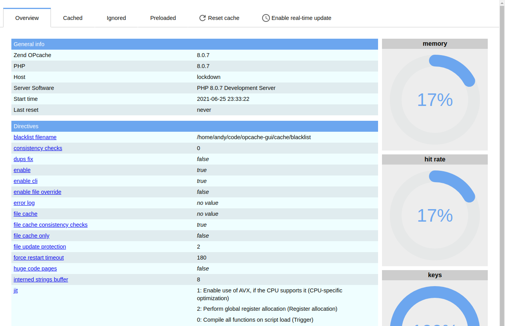

<!--
To README zostało automatycznie wygenerowane przez <https://github.com/YunoHost/apps/tree/master/tools/readme_generator>
Nie powinno być ono edytowane ręcznie.
-->

# OPcache GUI dla YunoHost

[](https://ci-apps.yunohost.org/ci/apps/opcache-gui/)


[](https://install-app.yunohost.org/?app=opcache-gui)

*[Przeczytaj plik README w innym języku.](./ALL_README.md)*

> *Ta aplikacja pozwala na szybką i prostą instalację OPcache GUI na serwerze YunoHost.*  
> *Jeżeli nie masz YunoHost zapoznaj się z [poradnikiem](https://yunohost.org/install) instalacji.*

## Przegląd

A clean and responsive interface for Zend OPcache information, showing statistics, settings and cached files, and providing a real-time update for the information.


**Dostarczona wersja:** 3.5.5~ynh1

## Zrzuty ekranu



## Dokumentacja i zasoby

- Repozytorium z kodem źródłowym: <https://github.com/amnuts/opcache-gui>
- Sklep YunoHost: <https://apps.yunohost.org/app/opcache-gui>
- Zgłaszanie błędów: <https://github.com/YunoHost-Apps/opcache-gui_ynh/issues>

## Informacje od twórców

Wyślij swój pull request do [gałęzi `testing`](https://github.com/YunoHost-Apps/opcache-gui_ynh/tree/testing).

Aby wypróbować gałąź `testing` postępuj zgodnie z instrukcjami:

```bash
sudo yunohost app install https://github.com/YunoHost-Apps/opcache-gui_ynh/tree/testing --debug
lub
sudo yunohost app upgrade opcache-gui -u https://github.com/YunoHost-Apps/opcache-gui_ynh/tree/testing --debug
```

**Więcej informacji o tworzeniu paczek aplikacji:** <https://yunohost.org/packaging_apps>
